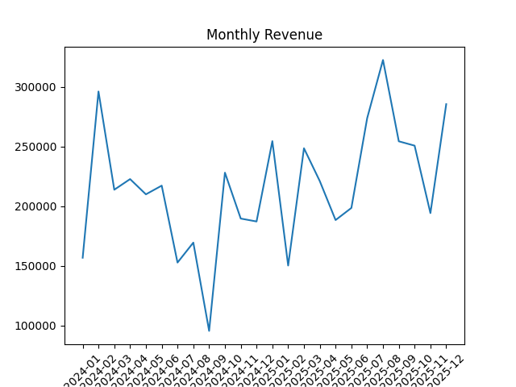
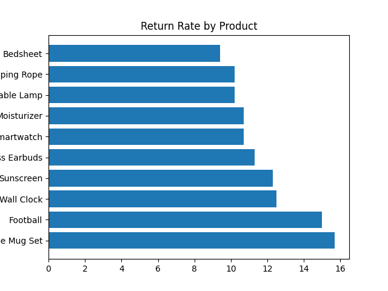
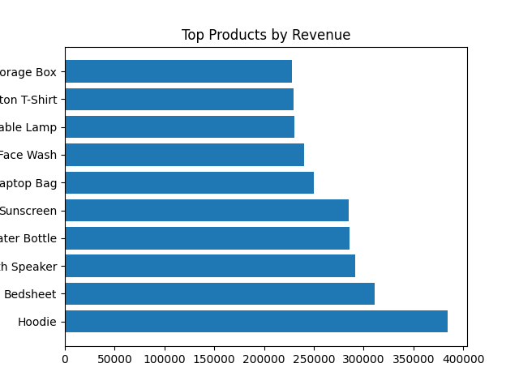
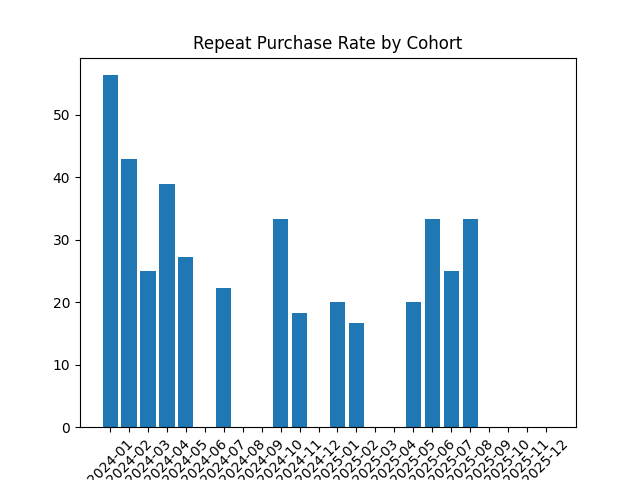
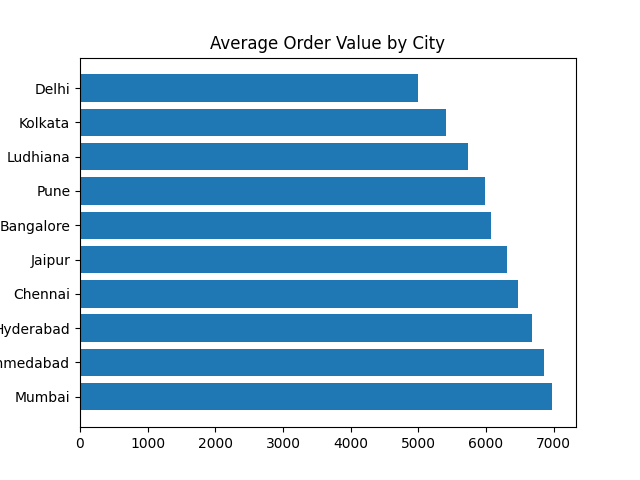

# Findings — E-commerce Sales & Customer Analytics

Analysis based on **460 orders** across **110 customers** and **18 products** (Jan–Dec 2024).
Source: `ecommerce_1500.sql`

---

## 1. Top Customers

The top 10% of customers by spend show a steep drop-off: **Isha Nair** (Jaipur) leads with
₹2.54L, followed by **Pooja Sharma** (Delhi) at ₹1.92L — together these two outspend the rest
of the top 10 combined. After that, spend flattens out into a more typical range (₹25k–₹85k).

**Takeaway:** Revenue here is concentrated in a couple of standout customers rather than
spread evenly — worth understanding what drives their unusually high spend (frequency vs.
order size) before designing any retention strategy.

---

## 2. Monthly Revenue Trend

  

Revenue swings noticeably month to month — from a low of ₹87k (Feb) to a high of ₹163k (Nov),
with growth swings as large as +44.5% (April) and -32.3% (June). There's a loose upward drift
across the year (Q4 months are generally higher than Q1), but it's not a clean trend line.

**Takeaway:** No strong seasonality pattern is baked into this data, so month-to-month
volatility here is mostly natural variance from a moderate order volume, not a signal to
read too much into.

---

## 3. Product Return Rates

**Coffee Mug Set** has the highest return rate at 18.5%, followed by **Power Bank** and
**Table Lamp** (both 16.7%). Home and Electronics categories show up most often in the
top 10 — but the pattern isn't fully clean, since Beauty and Sports items also appear.
Return rate doesn't track cleanly with price either (the cheapest item, Coffee Mug Set,
has the highest return rate; the priciest, Smartwatch, is mid-pack).

**Takeaway:** With this dataset, treat return rate patterns as loosely suggestive rather
than a firm category signal — the underlying returns are randomly assigned per item, so
some clustering by category is coincidental.

---

## 4. Top Products by Revenue

**Smartwatch** is the clear #1 by revenue (₹2.52L), well ahead of #2 Bluetooth Speaker
(₹1.47L) — driven by its high unit price (₹3,999) even though Power Bank and Football
actually sold more units. Electronics dominates the top of this list (4 of the top 5),
with Clothing and Home filling out the rest.

**Takeaway:** Revenue leaders here are price-driven, not just volume-driven — a useful
distinction to call out if asked "what's your best-selling product" vs. "what's your
highest-revenue product," since they're not the same thing (Football sold more units
than Smartwatch, but earns far less revenue).

---

## 5. Repeat Purchase Behavior (Cohorts)

Early-year cohorts show strong repeat rates: Feb 2024 customers hit 63.6% repeat-within-90-days,
and Jan 2024 hit 58.3%. Rates dip and get noisier through the middle of the year, and the last
few months (Oct–Dec) show very small cohort sizes (2–4 customers), making their repeat rates
unreliable on their own (e.g. Oct shows "100%" but that's just 2 out of 2 customers).

**Takeaway:** Don't read too much into the Nov/Dec numbers — small sample size makes them
noisy. Also remember the built-in bias: cohorts from the last 90 days of the dataset haven't
had a fair chance to show a repeat purchase yet, so recent months are structurally understated.

---

## 6. Average Order Value by City

AOV is fairly tight across all 7 cities — everything falls between ₹3,213 (Delhi) and ₹3,884
(Pune), a difference of about 20%. Jaipur and Delhi have the highest order *counts* (93 and 89)
but sit in the middle-to-bottom of the AOV ranking — so their revenue comes from order volume,
not bigger baskets.

**Takeaway:** No city stands out as dramatically higher-value per order; if there's a growth
lever here, it's more likely order frequency/volume than upselling bigger baskets.

---

## Honest caveats

Note: this is a synthetic dataset built for practice — patterns like return rates and city differences are close to random by construction rather than reflecting real customer behavior, and small cohort sizes in later months make the repeat-purchase chart noisy.
